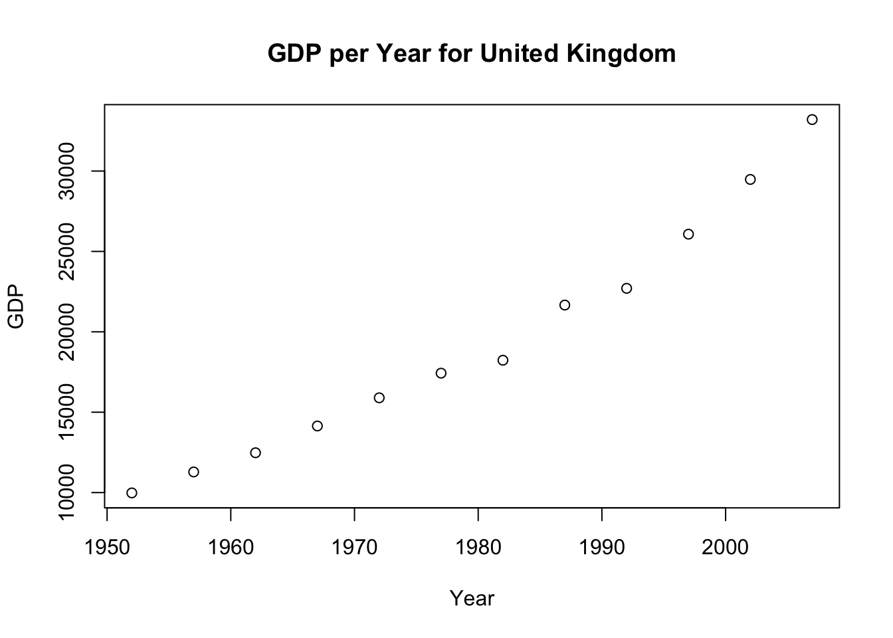
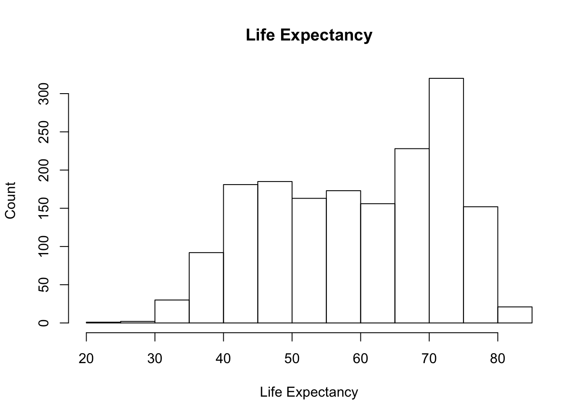

# Final exercise on gapminder population data
Guillermo Ponce  
10/4/2015  


 

A steep increasing trend in GDP for Australia

 

In the case of U.K., it also shows a similar trend to Australia.

 

Mexico shows an increasing trend in GDP after 1984


The average, minimum and maximum life expectancy for these countries are:


```
##           Country Avg_LifeExp Min_LifeExp Max_LifeExp
## 1:      Australia    74.66292      69.120      81.235
## 2:         Mexico    65.40883      50.789      76.195
## 3: United Kingdom    73.92258      69.180      79.425
```

Distribution of life expectancy.
Standard bin-width

 

Bin-width changed

 
